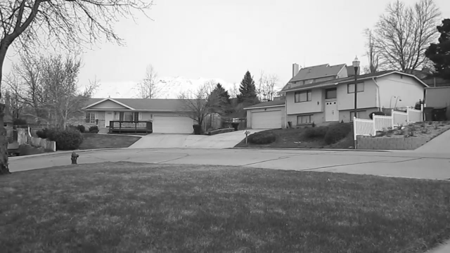
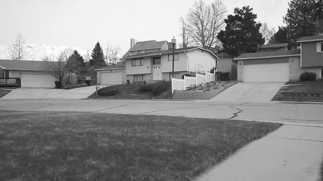
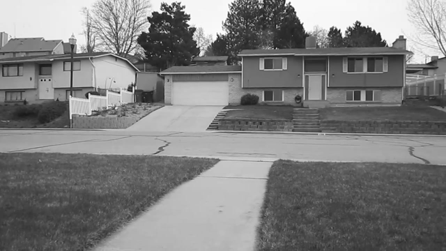
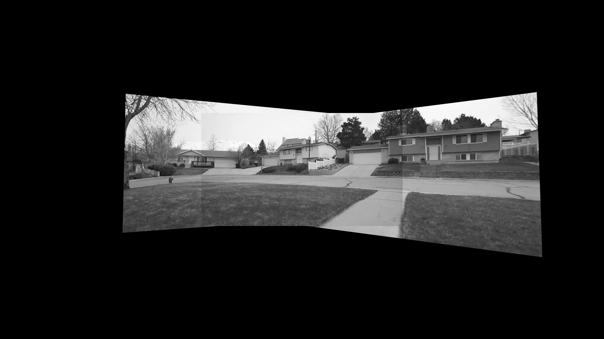
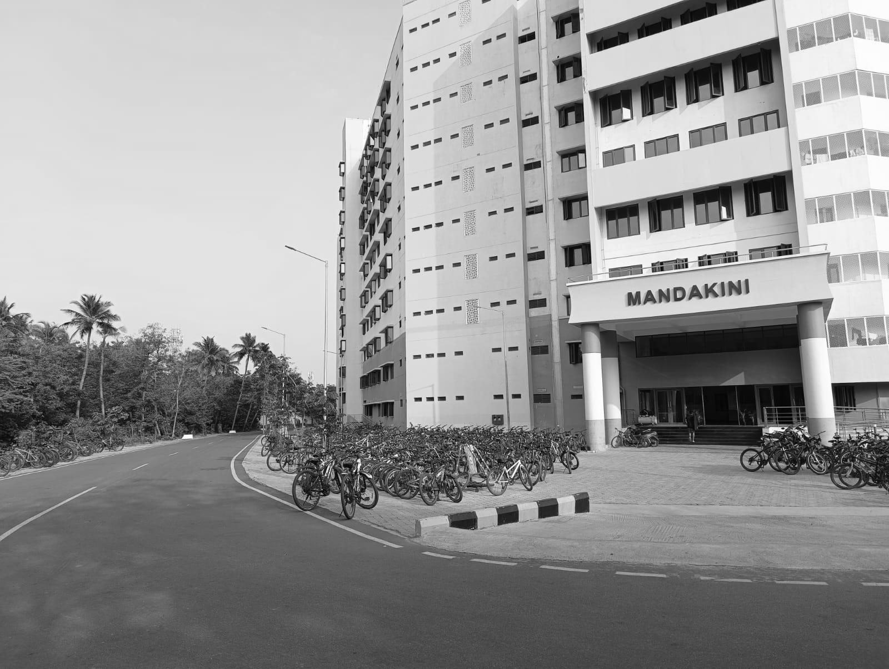
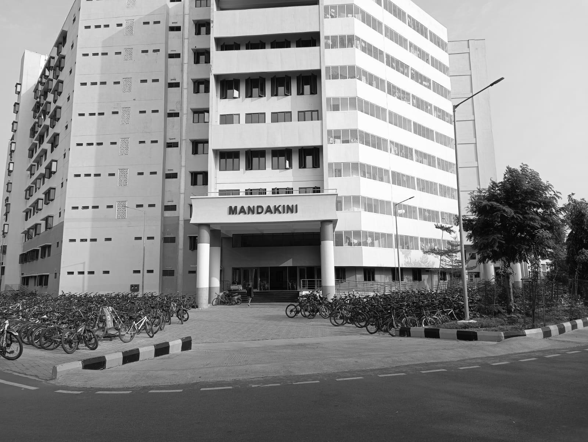
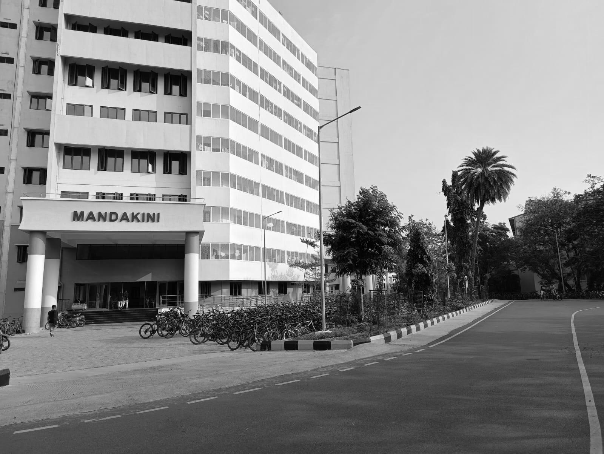
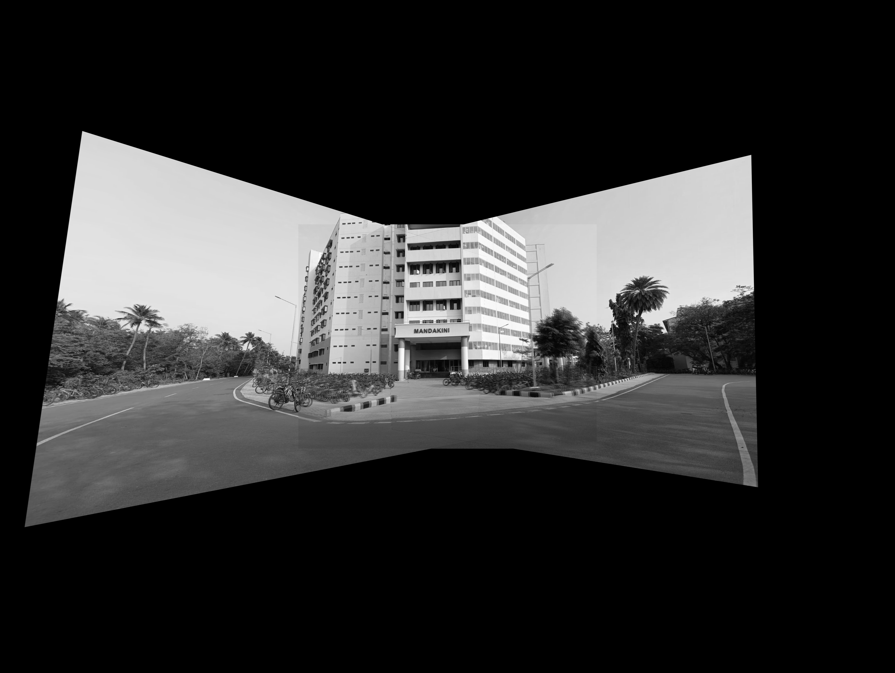

# Image Mosaicing using Homography and SIFT

This project implements image mosaicing by stitching together multiple images that have overlapping regions into a single panoramic image. The Python script aligns the images using homography transformations, calculates the necessary transformations using SIFT features, and blends them to create a seamless mosaic.

## Overview

Image mosaicing is the process of stitching multiple images with overlapping regions into a single composite image. In this project, I used:

- **Homography transformations** to align the images.
- **SIFT (Scale-Invariant Feature Transform)** to detect and describe local features.
- **RANSAC (Random Sample Consensus)** to remove outliers from the feature correspondences and calculate the homography matrix.

## Input Images

The following images were used as input to create the mosaic:

| Image 1           | Image 2           | Image 3           |
| ----------------- | ----------------- | ----------------- |
|  |  |  |

## Result

The resulting mosaic after stitching the three input images is:

### Another example

| Image 1           | Image 2           | Image 3           |
| ----------------- | ----------------- | ----------------- |
|  |  |  |

### Result

The resulting mosaic after stitching the three input images is:

